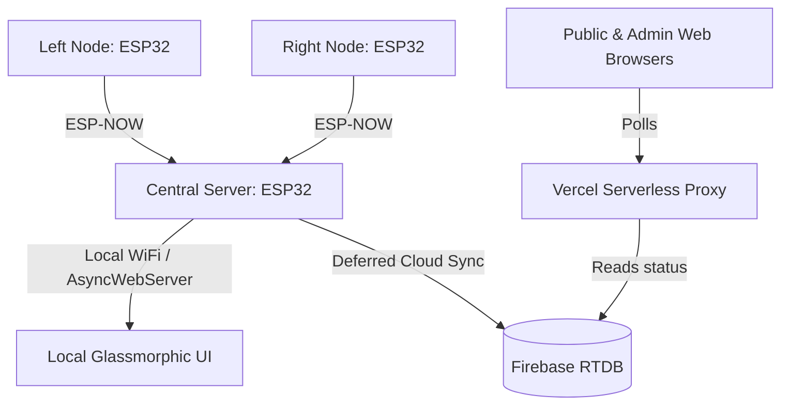

# Smart Parking System

An IoT-based intelligent parking occupancy monitoring and entry gating system. It uses ESP32 sensor nodes, a central ESP32 processing server, and a cloud-mirrored web dashboard to offer local and remote monitoring.



---

## 1. System Architecture

The project is split into three main tiers:

### A. ESP-NOW Sensor Nodes
*   **Sensor Node Left (L1-L5)**: Continuously checks the state of the left-side parking spots using physical sensors and broadcasts slot statuses via low-power ESP-NOW.
*   **Sensor Node Right (R1-R5)**: Broadcasts slot statuses for the right-side parking spots.

### B. Central Server (ESP32 Firmware)
*   **Location**: `Central_Server/`
*   **Role**: Handles the main execution loop:
    *   **ESP-NOW receiver**: Decodes sensor payloads asynchronously.
    *   **Gate Control**: Toggles physical entry servo and LEDs based on occupancy.
    *   **Local Web Server**: Serves a responsive, modern Glassmorphic dashboard directly on the local network (`http://10.174.86.121`).
    *   **Firebase Syncer**: Offloads HTTPS cloud writing to the main loop to prevent CPU watchdog resets.
    *   **mDNS & OTA Service**: Enables wireless firmware updates via Arduino IDE.

### C. Cloud Mirror Dashboard (Vercel)
*   **Location**: `Vercel_Mirror/`
*   **Role**: Mirrors the local system status on the public web, pulling data from Firebase Realtime Database and protecting credentials using a serverless backend proxy.

---

## 2. Directory Structure

```text
basit project/
├── Central_Server/
│   ├── Central_Server.ino   # Main ESP32 C++ firmware sketch
│   └── web_templates.h      # PROGMEM-stored HTML/CSS/JS local dashboards
├── Vercel_Mirror/
│   ├── vercel.json          # Deployment routing configuration
│   ├── api/
│   │   └── data.js          # Node.js serverless proxy function
│   └── public/
│       ├── index.html       # Cloud Public Dashboard
│       └── admin.html       # Cloud Admin Dashboard
└── README.md                # System documentation (this file)
```

---

## 3. Configuration & Pin Out (Central Server)

*   **Mode Switch Pin**: GPIO 12 (Used to toggle between Force Online and Auto Mode).
*   **Gate Servo Pin**: GPIO 13.
*   **I2C LCD**: SDA (GPIO 21), SCL (GPIO 22). Address: `0x27`.
*   **WiFi Hostname**: `SmartParking`.

---

## 4. Key Performance Optimizations

1.  **Watchdog Stabilization**: Firebase sync operations are deferred from ESP-NOW interrupts using a `pendingCloudSync` flag, avoiding Task Watchdog crashes on CPU 0.
2.  **Non-blocking Connections**: WiFi connection logic runs in the background as a state machine rather than blocking the main loop with synchronous loops.
3.  **Flash Memory Savings**: Dashboards are stored in Flash (`PROGMEM`) raw literal structures in `web_templates.h` to minimize dynamic RAM usage on the ESP32.
