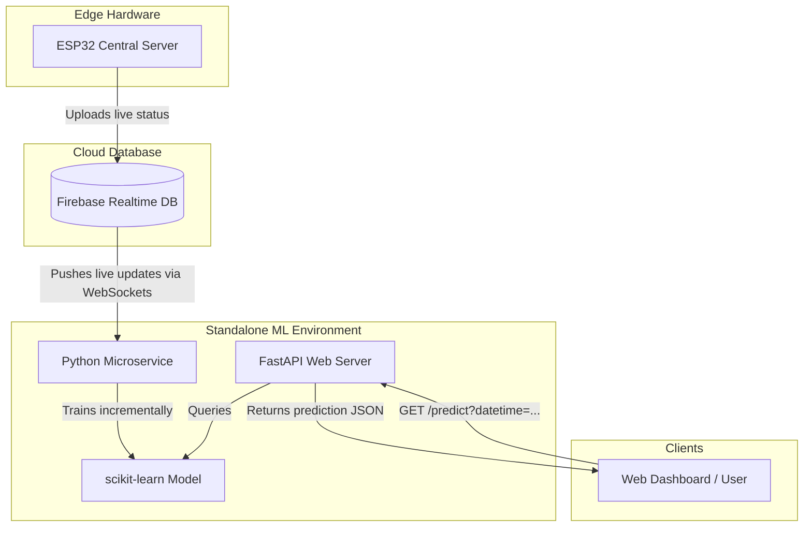

# Standalone ML Prediction Service Architecture

Deploying your machine learning model as a separate service is an excellent design pattern. It decouples the heavy machine learning computation from both your database and your ESP32 hardware.

---

## 1. System Architecture Diagram



---

## 2. Python Service Code (`app.py`)

This standalone script uses **FastAPI** (to serve prediction endpoints) and **Firebase Admin SDK** (to listen to parking events and train the model in the background).

### Prerequisites
Run the following in your deployment environment terminal to install dependencies:
```bash
pip install fastapi uvicorn scikit-learn firebase-admin numpy
```

### Script Implementation
Save the code below as `app.py`:

```python
import os
import pickle
import datetime
import numpy as np
from fastapi import FastAPI, Query
from fastapi.middleware.cors import CORSMiddleware
import firebase_admin
from firebase_admin import credentials, db
import threading

app = FastAPI(title="Smart Parking Predictor API")

# Allow CORS so your web dashboard can query this API directly from a browser
app.add_middleware(
    CORSMiddleware,
    allow_origins=["*"],
    allow_credentials=True,
    allow_methods=["*"],
    allow_headers=["*"],
)

MODEL_PATH = "parking_model.pkl"
model = None

# ==================== 1. ML MODEL HELPERS ====================

def get_cyclical_features(dt: datetime.datetime):
    """Encodes time and day into sine/cosine features for the model."""
    hour = dt.hour + (dt.minute / 60.0)
    day = dt.weekday()
    
    hour_sin = np.sin(2 * np.pi * hour / 24.0)
    hour_cos = np.cos(2 * np.pi * hour / 24.0)
    day_sin = np.sin(2 * np.pi * day / 7.0)
    day_cos = np.cos(2 * np.pi * day / 7.0)
    
    return np.array([[hour_sin, hour_cos, day_sin, day_cos]])

def initialize_model():
    global model
    from sklearn.linear_model import SGDRegressor
    
    if os.path.exists(MODEL_PATH):
        with open(MODEL_PATH, "rb") as f:
            model = pickle.load(f)
        print("🤖 Loaded existing model from disk.")
    else:
        # Initialize a new incremental model
        model = SGDRegressor(learning_rate='constant', eta0=0.01)
        print("🤖 Created a new SGDRegressor model.")

# ==================== 2. FIREBASE SUBSCRIBER ====================

def on_firebase_update(event):
    """Callback triggered whenever ESP32 updates /parking/current."""
    global model
    if event.data is None or model is None:
        return
        
    try:
        current_occ = event.data.get("occupancyRate")
        # Ensure we have a valid occupancy rate
        if current_occ is None:
            return
            
        now = datetime.datetime.now()
        X = get_cyclical_features(now)
        y = np.array([float(current_occ)])
        
        # Continuously train the model on the new data point
        model.partial_fit(X, y)
        
        # Save the updated model weights
        with open(MODEL_PATH, "wb") as f:
            pickle.dump(model, f)
            
        print(f"📈 Model trained on new data: {current_occ}% occupancy at {now.strftime('%H:%M')}")
    except Exception as e:
        print(f"❌ Error during training step: {e}")

def start_firebase_listener():
    """Starts listening to Firebase in a background thread."""
    try:
        # Ensure your serviceAccountKey.json is in the same directory
        cred = credentials.Certificate("serviceAccountKey.json")
        firebase_admin.initialize_app(cred, {
            'databaseURL': 'https://car-parking-system-a2064-default-rtdb.firebaseio.com/'
        })
        
        # Start listening to updates on /parking/current
        db.reference("/parking/current").listen(on_firebase_update)
        print("📡 Firebase Realtime Listener active.")
    except Exception as e:
        print(f"❌ Failed to initialize Firebase: {e}")

# Initialize model and start background listener on startup
@app.on_event("startup")
def startup_event():
    initialize_model()
    # Start the Firebase listener in a separate thread so it doesn't block FastAPI
    listener_thread = threading.Thread(target=start_firebase_listener, daemon=True)
    listener_thread.start()

# ==================== 3. API ENDPOINTS ====================

@app.get("/")
def read_root():
    return {"status": "online", "message": "Smart Parking Prediction API is running."}

@app.get("/predict")
def predict_occupancy(
    dt_str: str = Query(
        None, 
        alias="datetime", 
        description="ISO Datetime string (e.g. 2026-06-07T14:30:00). Defaults to current time."
    )
):
    """
    Exposes an endpoint to retrieve occupancy prediction for a given date and time.
    Usage: GET /predict?datetime=2026-06-07T18:00:00
    """
    global model
    if model is None:
        return {"error": "Model not loaded yet."}
        
    try:
        if dt_str:
            dt = datetime.datetime.fromisoformat(dt_str)
        else:
            dt = datetime.datetime.now()
            
        X = get_cyclical_features(dt)
        
        # Get prediction
        # If the model hasn't seen enough training steps yet, predict() might raise an error
        try:
            pred = model.predict(X)[0]
            pred = float(max(0.0, min(100.0, pred))) # Clamp between 0% and 100%
        except Exception:
            pred = 0.0 # Fallback default
            
        # Classify peak vs low period based on occupancy rate threshold (e.g. > 70% is Peak)
        period_type = "Low/Normal"
        if pred >= 70.0:
            period_type = "Peak"
        elif pred <= 20.0:
            period_type = "Very Low"

        return {
            "requested_time": dt.isoformat(),
            "predicted_occupancy_rate": round(pred, 1),
            "predicted_occupied_slots": round((pred / 100.0) * 10),
            "period_type": period_type
        }
    except Exception as e:
        return {"error": f"Invalid request parameters: {e}"}

if __name__ == "__main__":
    import uvicorn
    # Start the local development server on port 8000
    uvicorn.run(app, host="0.0.0.0", port=8000)
```

---

## 3. How to Deploy This Service

1.  **Get Firebase Credentials**:
    *   Go to **Project Settings** > **Service accounts** in the Firebase console.
    *   Click **Generate new private key** to download a `serviceAccountKey.json` file.
    *   Place this JSON file in the same folder as `app.py`.
2.  **Run Locally / On VPS**:
    *   Execute the application:
        ```bash
        python app.py
        ```
    *   It will run on `http://localhost:8000` (or the IP of your VM).
3.  **Get Live Predictions**:
    *   Open `http://localhost:8000/predict` in a browser or query it from your front-end dashboard to get the prediction for the current time.
    *   Query `http://localhost:8000/predict?datetime=2026-06-07T17:30:00` to predict occupancy for Sunday at 5:30 PM.
